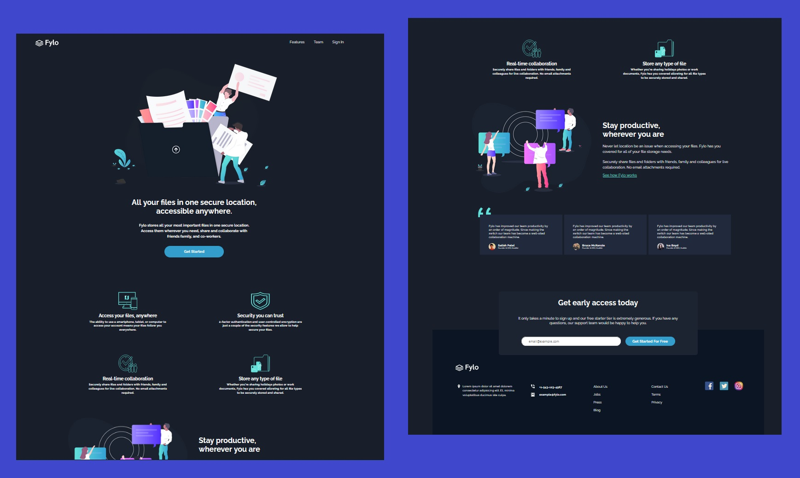
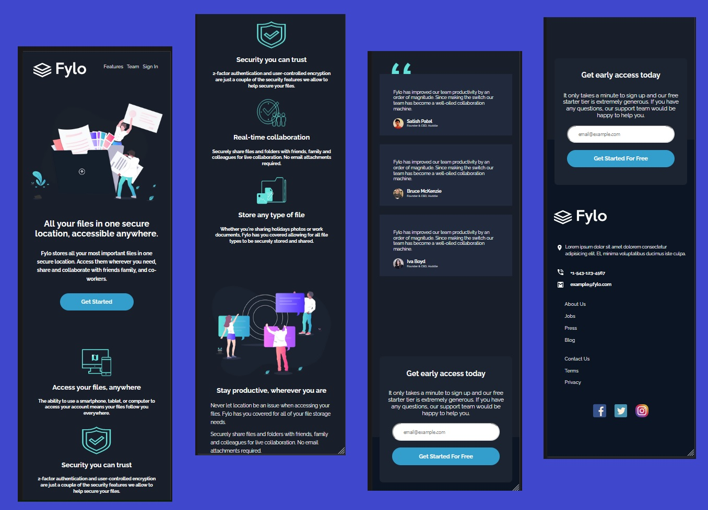

# 📝 Desafio landing-page-fylo
Projeto de desafio do Frontend Mentor para criação de uma Landig Page responsiva

<h4><a href="https://brunooliveira16.github.io/landing-page-fylo/">Link do desafio</a></h4>

## 💻 Screenshot do projeto

- Designer 01

- Designer 02

<h4 align="center"><a href="https://brunooliveira16.github.io/landing-page-fylo/">Clique aqui e visite o projeto</a></h4>

## 📚 Descrição

Construir esta página de destino para que seus usuários devam ser capazes de:
- **Layout Responsivo:** Visualize o layout ideal para o site, dependendo do tamanho da tela do dispositivo;
- **Interação dos elementos:** Veja os estados de foco para todos os elementos interativos na página;
---

## 💼 Tecnologias utilizadas

- HTML;
- CSS;

---
## 🙋🏻‍♂️ Autor

Bruno Oliveira

